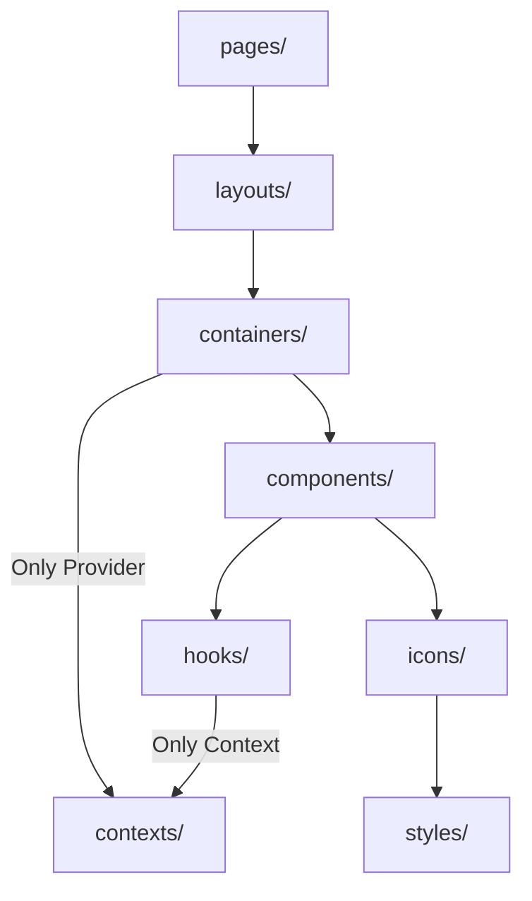

# About Cards

**cards** is a React-based project focused on building **3D interactive card experiences** using native HTML elements.
The animation system is powered by **`motion/react`**, forming the foundation of a fully custom, modular, and extensible **card animation engine**.

Unlike typical card projects that rely on simplified logic or random shuffling, Cards is designed to simulate **real-world card behaviors**, including:

- Authentic **Overhand Shuffle** / **Riffle Shuffle** animations
- 3D card stacking using **`rotate3d`** / **`translateZ`** transforms
- Responsive **multi-row fan-out layouts** that dynamically adapt to any screen size
- Fully **data-driven behaviors**, not pre-rendered animations or static randomness

The entire project is structured around clear module boundaries: shuffling, spreading, drawing, revealing, card-state management, and animation sequencing are all abstracted into dedicated hooks and containers.

Each "Stage" represents a specific interaction scene, and multiple stages can be composed to form a complete card-drawing flow.

**Cards is a side project that blends deep UI interaction design with clean, scalable frontend architecture—exploring how far true-to-life card animations can go in the browser.**

---

## Getting Started

This project uses **Node.js v24.11.1**, defined in **`.nvmrc`**.

1. Install dependencies
   Use `npm ci` to install packages strictly based on the existing lockfile:
   ```zsh
   npm ci
   ```
2. Start the development server
   Run:
   ```
   npm run dev
   ```
   The Vite development server will start and automatically open in your browser.

## Dependency Rule



This project follows a **One-way Dependency Flow** principle:

- Each folder may only import modules that lie downstream along the arrow direction
- Upstream or reverse imports are not allowed

> This rule is also enforced via **ESLint**.
